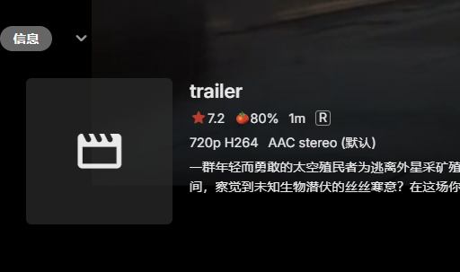

# Emby-Javascript-Details
Add some features for Emby detail page

## 功能：
### emby_detail_page.js
   1. 展示剧照
      - 部分代码来自于：https://github.com/newday-life/emby-front-end-mod/tree/main/fanart_show
      - 感谢作者：https://github.com/newday-life
      - 用文件名排序
      - 
      - 
   2. 在“更多类似”下面增加此演员及导演其他作品展示。
      - 如有多个演员，则随机选择其中一个；
      - 如有超过12部作品，则随机选择12部展示。
      - 
   3. 翻译标题和详情功能。
      - 需自行添加 google API key (in config.json)
   4. 加载Javdb内容。
      - 需要自行修改 javDbFlag
      - Emby User ID 必须匹配 （in config.json）
      - 结合 MDCx 使用：https://github.com/sqzw-x/mdcx
      
### trailer_more_button.js

1. 播放本地trailer时，添加影片源信息和跳转功能

## Before



## After


      
### list_page.js
   1. list页鼠标悬停自动播放本地trailer （alternative: https://github.com/newday-life/emby-web-mod/tree/main/trailer ）

### config.json
   1. save configs. 必须放在index.html同级目录中
   2. google API key （选填。不添加不会触发翻译功能）
   3. Emby User ID （选填。不添加不会触发JavDb功能）

### style.css
   1. css styles

## 部署服务器方法 1：
1. 在客户端或网页的 `index.html` <body></body> 标签最后，插入以下内容：
   ```
   <script src="https://kit.fontawesome.com/d82d05d46e.js" crossorigin="anonymous"></script>
   <script src="https://cdn.jsdelivr.net/npm/opencc-js@1.0.5/dist/umd/cn2t.js"></script>
   <script type="text/javascript" src="trailer_more_button.js"></script>
   <script type="text/javascript" src="emby_detail_page.js"></script>
   <script type="text/javascript" src="list_page.js"></script>
   <link rel="stylesheet" href="./style.css">
   ```
2. 将 `XXX.js` 文件下载放在index.html同级目录中，非window记得授权可读。

## 部署服务器方法 2：
配合Emby自定义JavaScript及Css项目：https://github.com/Shurelol/Emby.CustomCssJS 
   


